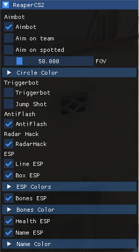

# Reaper CS2 Cheat - Offline Insecure (Educational Purpose Only) 🎮🔍

## Description 📝

This project is a cheat developed in **C#** for **Counter-Strike 2 (CS2)**. It is designed strictly for **educational purposes** and works only in **offline** mode with the `-insecure` launch option enabled. The cheat includes several features such as **Aimbot**, **ESP**, **RadarHack**, **Antiflash**, and much more.

## Prerequisites ✅

- **Counter-Strike 2** (CS2) installed.
- Enable **insecure** mode in the game's launch options.

## Installation 💻

1. Download and extract the files to a directory of your choice.
2. Open **Steam**, right-click on **Counter-Strike 2** in your library.
3. Select **Properties**, then click on **Set Launch Options**.
4. Add `-insecure` to the command line.

## Instructions 🕹️

1. Launch **Counter-Strike 2** in **offline** mode with the `-insecure` option enabled.
2. Run the `.exe` file for the cheat.
3. Once in the game, you can customize the cheat settings through an interface.
   - Toggle the **Aimbot** on/off.
   - See enemies through walls with **ESP** (Wallhack).
   - Use the **RadarHack** to spot enemies through walls.
   - Protect yourself from **flashbangs** with the **Antiflash** feature.
   - And much more!

### Hotkey to Activate Cheats ⌨️

To activate the cheats in the compiled version, press the **side mouse button** (usually located on the side of the mouse).

## Features 🌟

Here is a detailed list of the cheat features:

### 1. **Aimbot** 🎯

- **Description**: Automatically aims at enemies within range, making precise shots easier.
- **Customization**: Adjust the **aim zone**, and **targeting priority**.

### 2. **ESP (Wallhack)** 👁️

- **Description**: Shows enemies through walls with detection boxes, allowing you to spot them easily.
- **Customization**: You can adjust the color and size of the boxes, as well as the types of enemies to display (enemies, teammates, etc.).

### 3. **RadarHack** 🔍

- **Description**: Displays the position of enemies on your radar, even if they are behind walls or obstacles.
- **Customization**: This can be enabled or disabled.

### 4. **Antiflash** 🕶️

- **Description**: Disables the effects of flashbangs, allowing you to play normally without being blinded.
- **Customization**: This can be enabled or disabled.

### 5. **Triggerbot** 🔫

- **Description**: Automatically shoots when the crosshair is over an enemy.
- **Customization**: This can be enabled or disabled.

### 6. **Jump Shot** 🦘

- **Description**: Automatically shoot, when you hit the high of your jump. Very Useful with snipers.
- **Customization**: This can be enabled or disabled.

### 7. **Stream Ready** 📺

- **Description**: Unvisible on capture. :)

---

## Screenshots 📸

### Game Screenshot

### Menu Screenshot

---

## Disclaimer ⚠️

Using cheats in online games may result in penalties, including **account bans**. This project is intended for use in a secure environment and solely for educational and learning purposes regarding how cheats work.

**Note**: This project is provided for educational purposes only. Using it in online play against other players or in uncontrolled environments may violate Steam's and **Counter-Strike 2**'s Terms of Service. Use it only in **offline** mode.

---

**Important** ⚡: After every game update, it is necessary to update the **offsets** and recompile the cheat to ensure proper functionality. Always make sure to check that the offsets are up to date to avoid any malfunctions.

---

## Acknowledgements 🙏

A big thanks to **Swedz C#** for his tutorials and valuable help in the development of this cheat. You can check out his YouTube channel [here](https://www.youtube.com/@SwedishTwat/).

Also, thanks to **A2X** for his excellent **offset dumper**, which was essential in the creation of this project. You can find his project on GitHub [here](https://github.com/a2x/cs2-dumper/).